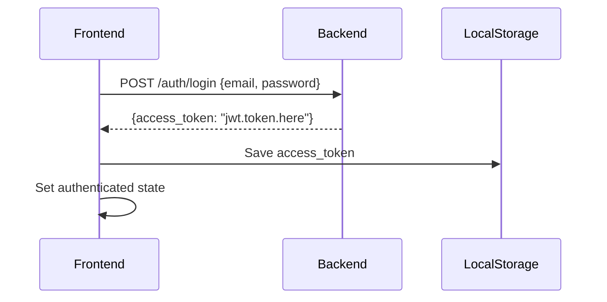
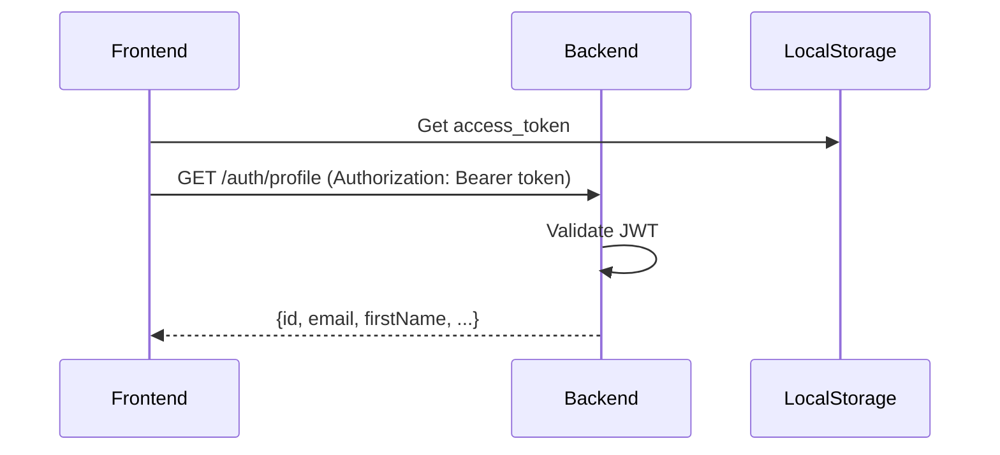

# Frontend-Backend Integration Guide

This document explains how the Next.js frontend connects to the NestJS backend using the FSD (Feature-Sliced Design) methodology.

## 🔗 Connection Overview

The frontend and backend are connected through a robust API client system that follows these principles:

1. **Separation of Concerns**: API logic is separated from UI components
2. **Type Safety**: Strong TypeScript typing throughout the stack
3. **Error Handling**: Comprehensive error management
4. **Loading States**: Built-in loading state management
5. **Authentication**: JWT token management

## 📁 File Structure

```
apps/web/
├── features/
│   └── api/
│       ├── auth.ts          # Auth-specific API calls
│       └── base-api.ts      # Base API client
├── shared/
│   └── api/
│       └── base-api.ts      # Core API functionality
└── widgets/                 # UI components that use the API
```

## 🚀 API Client Architecture

### Base API Client (`shared/api/base-api.ts`)

The foundation of our API communication system:

```typescript
// Core features:
- Automatic JWT token injection
- Error handling with custom ApiError class
- Loading state management
- Type-safe responses
- Environment-aware base URL
```

### Auth API Service (`features/api/auth.ts`)

Specialized auth services built on top of the base client:

```typescript
// Available methods:
- register() - User registration
- login() - User authentication
- getProfile() - Get user data
- logout() - End session
- forgotPassword() - Password recovery
- verifyCode() - Code verification
- resetPassword() - Password reset
- verifyEmail() - Email verification
```

### Auth Hook (`useAuth`)

React hook for easy API usage in components:

```typescript
const { login, register, isLoading, error } = useAuth()

// Example usage:
const handleLogin = async (email, password) => {
  try {
    const response = await login({ email, password })
    Auth.handleLoginResponse(response)
    // Redirect or show success
  } catch (error) {
    // Handle error
  }
}
```

## 🔌 Backend API Endpoints

All endpoints are automatically prefixed with `/api` and connect to `http://localhost:5000`:

| Endpoint | Method | Description | Auth Required |
|----------|--------|-------------|---------------|
| `/auth/register` | POST | User registration | ❌ |
| `/auth/login` | POST | User login | ❌ |
| `/auth/profile` | GET | Get user profile | ✅ |
| `/auth/logout` | POST | Logout | ✅ |
| `/auth/forgot-password` | POST | Request password reset | ❌ |
| `/auth/verify-code` | POST | Verify reset code | ❌ |
| `/auth/reset-password` | POST | Reset password | ❌ |
| `/auth/verify-email` | POST | Verify email | ❌ |

## 📡 Authentication Flow

### 1. Login Process



### 2. Protected Requests



## 🛠️ Usage Examples

### Basic Login Component

```tsx
"use client"

import { useState } from 'react'
import { useAuth, Auth } from '@/features/api/auth'
import { useRouter } from 'next/navigation'

export function LoginForm() {
  const [email, setEmail] = useState('')
  const [password, setPassword] = useState('')
  const { login, isLoading, error } = useAuth()
  const router = useRouter()

  const handleSubmit = async (e: React.FormEvent) => {
    e.preventDefault()
    try {
      const response = await login({ email, password })
      Auth.handleLoginResponse(response)
      router.push('/dashboard')
    } catch (err) {
      console.error('Login failed:', err)
    }
  }

  return (
    <form onSubmit={handleSubmit}>
      <input
        type="email"
        value={email}
        onChange={(e) => setEmail(e.target.value)}
        required
      />
      <input
        type="password"
        value={password}
        onChange={(e) => setPassword(e.target.value)}
        required
      />
      <button type="submit" disabled={isLoading}>
        {isLoading ? 'Logging in...' : 'Login'}
      </button>
      {error && <p className="error">{error.message}</p>}
    </form>
  )
}
```

### Registration Component

```tsx
"use client"

import { useState } from 'react'
import { useAuth, Auth } from '@/features/api/auth'
import { useRouter } from 'next/navigation'

export function RegisterForm() {
  const [formData, setFormData] = useState({
    email: '',
    password: '',
    firstName: '',
    lastName: '',
    phone: ''
  })
  const { register, isLoading, error } = useAuth()
  const router = useRouter()

  const handleSubmit = async (e: React.FormEvent) => {
    e.preventDefault()
    try {
      const response = await register(formData)
      Auth.handleLoginResponse(response)
      router.push('/dashboard')
    } catch (err) {
      console.error('Registration failed:', err)
    }
  }

  const handleChange = (e: React.ChangeEvent<HTMLInputElement>) => {
    setFormData({
      ...formData,
      [e.target.name]: e.target.value
    })
  }

  return (
    <form onSubmit={handleSubmit}>
      <input
        name="email"
        type="email"
        value={formData.email}
        onChange={handleChange}
        placeholder="Email"
        required
      />
      <input
        name="password"
        type="password"
        value={formData.password}
        onChange={handleChange}
        placeholder="Password"
        required
      />
      <input
        name="firstName"
        type="text"
        value={formData.firstName}
        onChange={handleChange}
        placeholder="First Name"
        required
      />
      <input
        name="lastName"
        type="text"
        value={formData.lastName}
        onChange={handleChange}
        placeholder="Last Name"
        required
      />
      <input
        name="phone"
        type="tel"
        value={formData.phone}
        onChange={handleChange}
        placeholder="Phone"
        required
      />
      <button type="submit" disabled={isLoading}>
        {isLoading ? 'Registering...' : 'Register'}
      </button>
      {error && <p className="error">{error.message}</p>}
    </form>
  )
}
```

## 🔒 Authentication Utilities

The `Auth` object provides helper functions:

```typescript
// Check authentication status
const isAuth = Auth.isAuthenticated()

// Get current token
const token = Auth.getToken()

// Clear authentication
Auth.clearAuth()

// Handle login response
Auth.handleLoginResponse({ access_token: 'your.token.here' })

// Handle logout
Auth.handleLogout()
```

## ⚠️ Error Handling

The system provides comprehensive error handling:

```typescript
try {
  const result = await authApi.getProfile()
} catch (error) {
  if (error instanceof ApiError) {
    // Handle specific API errors
    console.error(`API Error ${error.status}: ${error.message}`)
    if (error.status === 401) {
      // Handle unauthorized
      Auth.handleLogout()
    }
  } else {
    // Handle network or other errors
    console.error('Unexpected error:', error)
  }
}
```

## 🌐 Environment Configuration

Configure the backend URL in your environment:

```env
# .env.local
NEXT_PUBLIC_API_URL=http://localhost:5000
```

## 🧪 Testing the Connection

1. **Start backend server**:
   ```bash
   cd apps/backend
   pnpm start:dev
   ```

2. **Start frontend server**:
   ```bash
   cd apps/web
   pnpm dev
   ```

3. **Test API endpoints**:
   - Open browser developer tools
   - Check Network tab for API requests
   - Verify JWT tokens are being stored in localStorage

## 🔧 CORS Configuration

The backend is configured to accept requests from the frontend:

```typescript
// apps/backend/src/main.ts
app.enableCors({
  origin: true,
  credentials: true,
})
```

## 📦 Dependencies

Frontend dependencies for API communication:

```json
{
  "dependencies": {
    "react": "^18",
    "next": "^14",
    // No additional dependencies needed - uses native fetch API
  }
}
```

## 🎯 Best Practices

1. **Always use the API hooks** instead of direct fetch calls
2. **Handle errors gracefully** and provide user feedback
3. **Use loading states** to improve UX
4. **Secure sensitive data** - never log tokens
5. **Type all responses** for better developer experience
6. **Follow FSD principles** - keep API logic in features/shared layers

## 🚀 Next Steps

1. **Connect existing forms** to the new API system
2. **Add form validation** using the existing Validation feature
3. **Implement proper error display** in UI components
4. **Add success/failure notifications**
5. **Implement auto-redirect** after login/logout

The frontend-backend integration is now complete and ready for use! 🎉